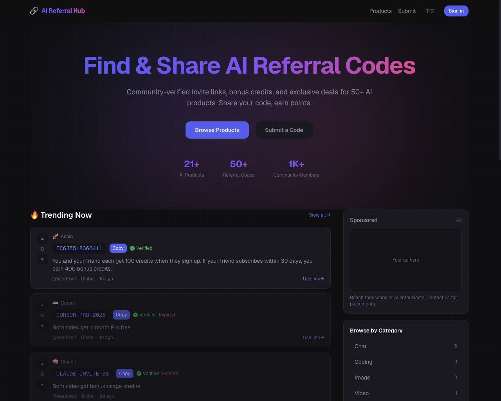

<div align="center">

# AI Referral Hub

**聚合 AI 产品邀请码、推荐链接与社区福利的开源站点** · *Discover & share AI referral codes*

[](https://nextjs.org/)
[](https://react.dev/)
[](https://www.typescriptlang.org/)
[](https://tailwindcss.com/)
[](https://supabase.com/)

[功能特性](#功能特性) · [本地开发](#本地开发) · [环境变量](#环境变量) · [English / 中文](#english--中文)

</div>

---

## 预览

截图来自线上环境 **[ai-referral-hub.vercel.app](https://ai-referral-hub.vercel.app/)**（`/en` 首页）：Hero 文案、主按钮、Trending 列表与响应式布局。

<p align="center">
  <b>首页 · 桌面端</b>（1280×1024）<br/><br/>
  
</p>

<p align="center">
  <b>首页 · 移动端</b>（375×812）<br/><br/>
  
</p>

**产品目录**与**产品详情**页支持分类筛选、推荐码卡片、复制与投票；可自行部署后浏览或补充截图至 `docs/screenshots/`。

---

## 项目简介

**AI Referral Hub** 面向使用 ChatGPT、Cursor、Midjourney 等 AI 工具的用户，集中展示 **社区提交的推荐码、邀请链接与双方权益说明**，并通过 **投票、举报与验证状态** 提高信息质量。站点支持 **英文 / 中文** 双语路由（`/en`、`/zh`），便于检索与分享。

适合作为：学习 **Next.js App Router + Supabase** 的全栈示例，或二次开发为垂直领域的「邀请码聚合站」。

---

## 功能特性

| 能力 | 说明 |
|------|------|
| 产品浏览 | 多分类筛选、产品详情与官方链接 |
| 推荐码列表 | 展示权益、地区、有效期、作者与投票数 |
| 社区治理 | 复制链接、投票、举报；支持已验证标识 |
| 用户提交 | 登录后提交推荐码或 **新增产品**（含审核流） |
| 个人中心 | 积分与已提交内容（需登录） |
| 国际化 | 英文、简体中文页面与 SEO 元数据 |
| 可观测性 | 可选接入 Vercel Analytics / Speed Insights |

---

## 技术栈

- **框架**: [Next.js](https://nextjs.org/) 16（App Router、Server Components）
- **UI**: React 19、Tailwind CSS 4、Geist 字体
- **数据与鉴权**: [Supabase](https://supabase.com/)（PostgreSQL、Auth、服务端与客户端）
- **部署**: 与 [Vercel](https://vercel.com/) 兼容（分析组件为可选依赖）

---

## 本地开发

**依赖**: Node.js 20+（建议与 Vercel 运行时一致）

```bash
npm install
npm run dev
```

浏览器访问 [http://localhost:3000](http://localhost:3000)（默认会重定向到 `/en`）。

其他命令：

```bash
npm run build   # 生产构建
npm run start   # 启动生产服务器
npm run lint    # ESLint
```

---

## 环境变量

在仓库根目录创建 `.env.local`（勿提交密钥），至少配置 Supabase 公开项：

| 变量 | 说明 |
|------|------|
| `NEXT_PUBLIC_SUPABASE_URL` | Supabase 项目 URL |
| `NEXT_PUBLIC_SUPABASE_ANON_KEY` | Supabase 匿名密钥（前端可用） |
| `SUPABASE_SERVICE_ROLE_KEY` | 服务端角色密钥（敏感操作，仅服务器） |
| `NEXT_PUBLIC_SITE_URL` | 站点绝对地址（用于邮件回调、sitemap、OAuth 等） |

未配置 Supabase 时，依赖数据库的页面可能无法正常拉取数据；请先完成 Supabase 项目与表结构迁移后再联调。

---

## English / 中文

- **Default locale**: `/en`
- **简体中文**: `/zh`

路由结构对称，便于搜索引擎与社交媒体分别抓取两种语言页面。

---

## 许可与贡献

若你改进文案、补充截图或修复问题，欢迎提交 Issue / Pull Request。使用本仓库时请遵守原项目许可（若尚未添加 `LICENSE` 文件，可由维护者补充）。

---

<div align="center">

**如果这个项目对你有帮助，欢迎 Star 支持曝光与持续维护。**

</div>
